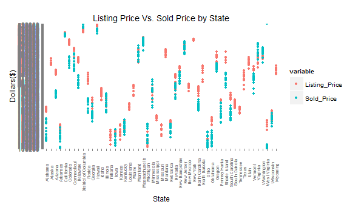
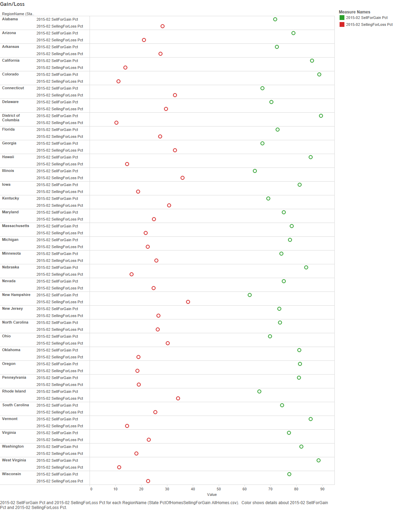
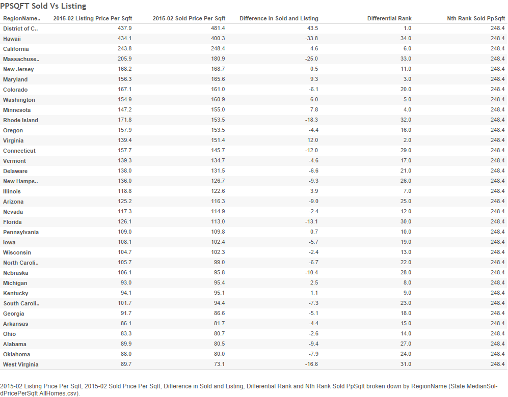
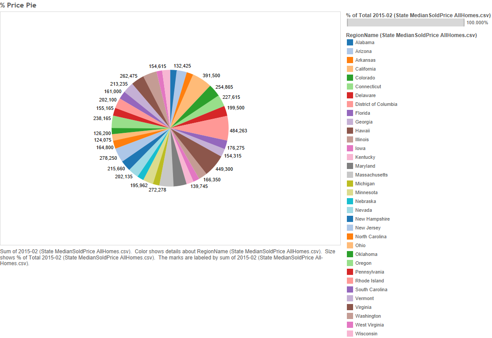
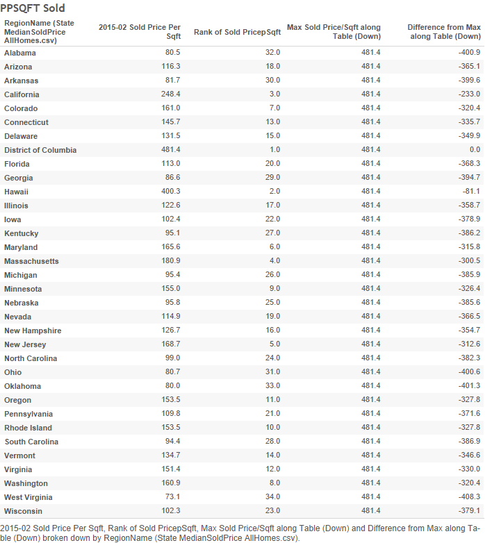
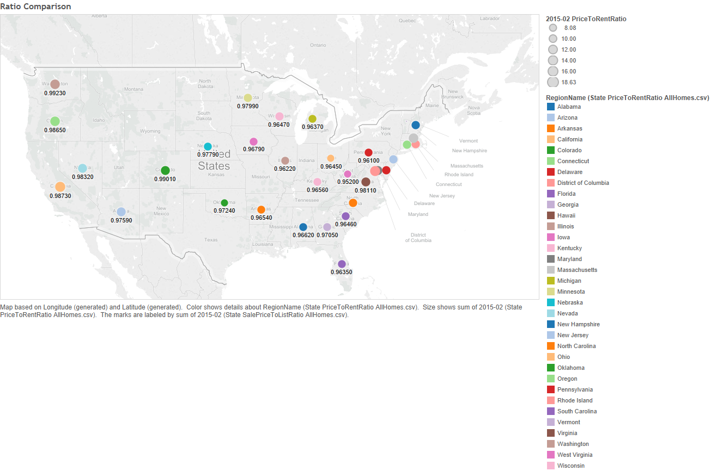
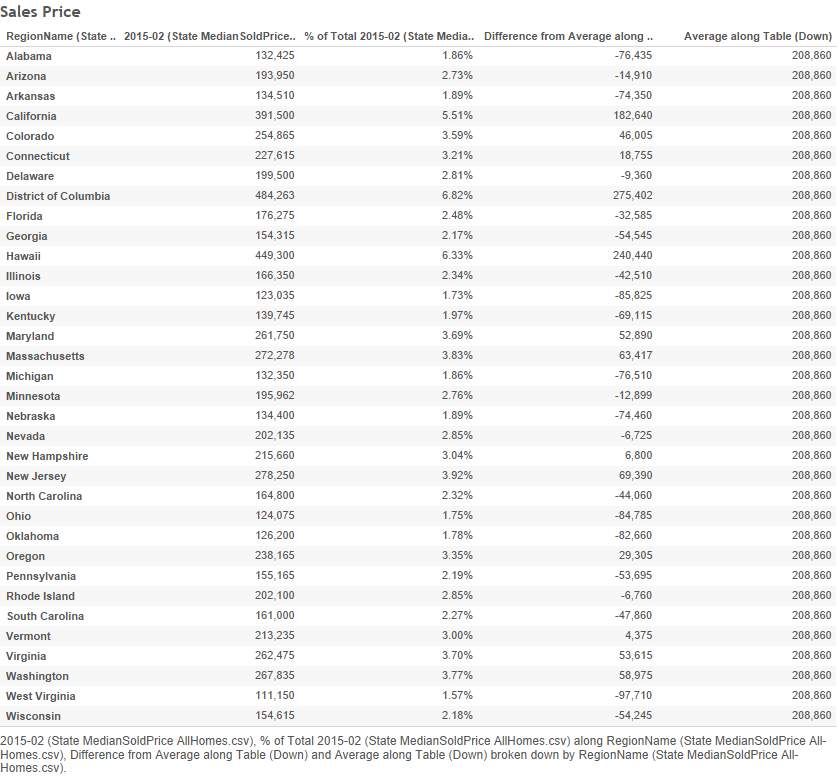
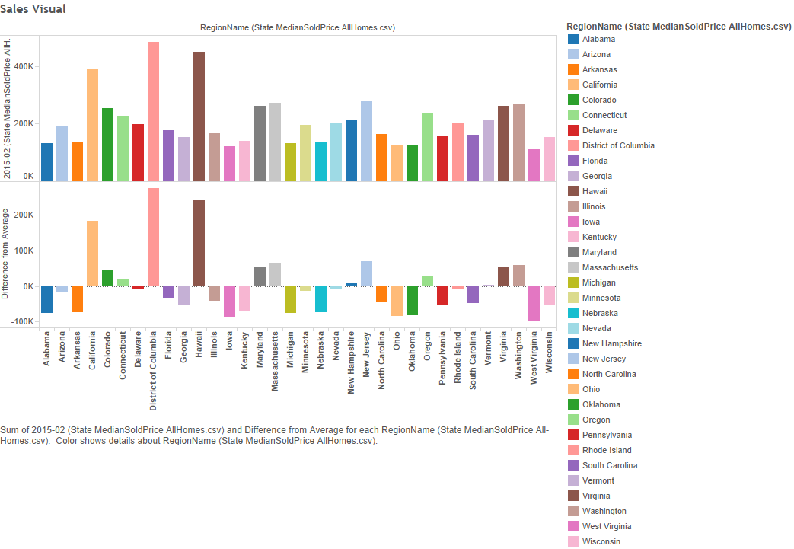

```{r}
source("../Rprofile.R", echo = FALSE) #load libraries
```
```{r}
source("../01 Data/Dataframes.R", echo = TRUE) #load dataframe
tbl_df(MedianListingPrice)
tbl_df(MedianListingPricePerSQFT)
tbl_df(MedianSoldPrice)
tbl_df(MedianSoldPricePerSQFT)
tbl_df(PctOfHomesSellingForGain)
tbl_df(PctOfHomesSellingForLoss)
tbl_df(PriceToRentRatio)
tbl_df(SalePriceToListRatio)
```
```{r}
source("../02 Data Wrangling/Data Wrangling.R", echo = TRUE) #load data wrangling
tbl_df(Listing_SoldPrice)
tbl_df(Sold_ListingPerSQFT)
tbl_df(Gain_Loss)
tbl_df(Ratio)
```
```
vis1melt1 <- melt(Listing_SoldPrice, measure.vars = c("FEB2014.x", "MAR2014.x", "APR2014.x", "MAY2014.x", "JUN2014.x", "JUL2014.x", "AUG2014.x", "SEP2014.x", "OCT2014.x", "NOV2014.x", "DEC2014.x", "JAN2015.x", "FEB2015.x"), id.vars = "REGIONNAME", value.name = "Listing_Price")

vis1melt2 <- melt(Listing_SoldPrice, measure.vars = c("FEB2014.y", "MAR2014.y", "APR2014.y", "MAY2014.y", "JUN2014.y", "JUL2014.y", "AUG2014.y", "SEP2014.y", "OCT2014.y", "NOV2014.y", "DEC2014.y", "JAN2015.y", "FEB2015.y"), id.vars = "REGIONNAME", value.name = "Sold_Price")

vis1melt3 = cbind(vis1melt1, vis1melt2)

vis1melt4 <- melt(vis1melt3, id.vars = "REGIONNAME", measure.vars = c("Listing_Price", "Sold_Price"))

vis1melt4 <- vis1melt4 %>% filter(value != "null")

vis1 <- ggplot(vis1melt4, aes(x=REGIONNAME, y=value, color=variable))+geom_point()

vis1 <- vis1 + theme(axis.text.x = element_text(angle=90, vjust=0.5, size=7)) + scale_x_discrete("State") + scale_y_discrete("Dollars($)") + ggtitle("Listing Price Vs. Sold Price by State")
ggsave(file="vis1.png", path="00 Doc")
```


```
vis2melt1 <- melt(Sold_ListingPerSQFT, measure.vars = c("FEB2014.x", "MAR2014.x", "APR2014.x", "MAY2014.x", "JUN2014.x", "JUL2014.x", "AUG2014.x", "SEP2014.x", "OCT2014.x", "NOV2014.x", "DEC2014.x", "JAN2015.x", "FEB2015.x"), id.vars = "REGIONNAME", value.name = "Listing_Price_PerSQFT")

vis2melt2 <- melt(Sold_ListingPerSQFT, measure.vars = c("FEB2014.y", "MAR2014.y", "APR2014.y", "MAY2014.y", "JUN2014.y", "JUL2014.y", "AUG2014.y", "SEP2014.y", "OCT2014.y", "NOV2014.y", "DEC2014.y", "JAN2015.y", "FEB2015.y"), id.vars = "REGIONNAME", value.name = "Sold_Price_PerSQFT")

vis2melt3 = cbind(vis2melt1, vis2melt2)

vis2melt4 <- melt(vis2melt3, id.vars = "REGIONNAME", measure.vars = c("Listing_Price_PerSQFT", "Sold_Price_PerSQFT"))

vis2melt4 <- vis2melt4 %>% filter(value != "null")

vis2 <- ggplot(vis2melt4, aes(x=REGIONNAME, y=value, color=variable))+geom_point()

vis2 <- vis2 + theme(axis.text.x = element_text(angle=90, vjust=0.5, size=7)) + scale_x_discrete("State") + scale_y_discrete("Dollars($)") + ggtitle("Listing Price Per SQFT Vs. Sold Price Per SQFT by State")
ggsave(file="vis2.png", path="00 Doc")
```

```
Tableau Worksheets
```












